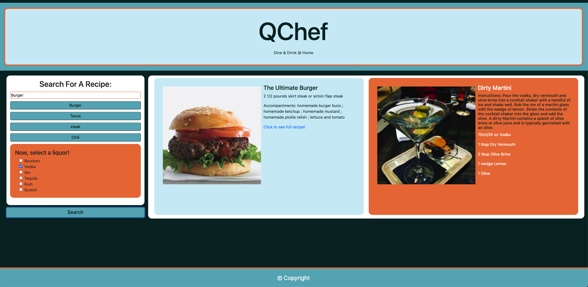

# QChef
## Group Project #1

LINK to deployed app: https://nicschworer.github.io/JASN_Project_01/

The assignment here was to work together, focusing on server-side APIs, git branching, and agile development, to create an application that calls at least two separate APIs. Our application takes in meal or dish input from the user, as well as the users liquor selection, and generates a corresponding meal and cocktail recipe. It also uses local storage to store the 4 most recent searches from the user and display them on the page. If these recent search elements are clicked, they bring up the recipe again.  

Here is a snapshot of the app:

